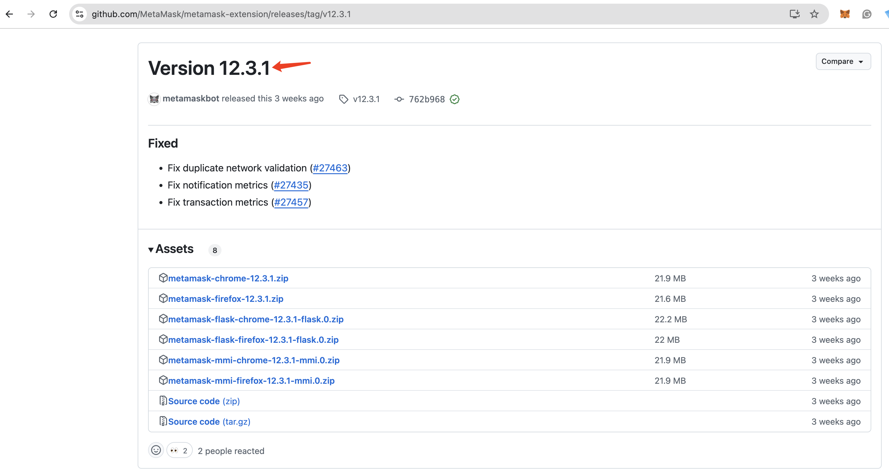
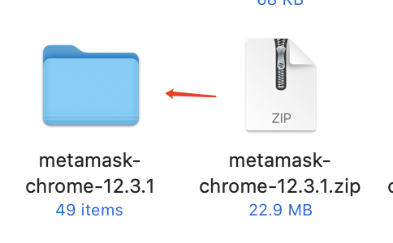
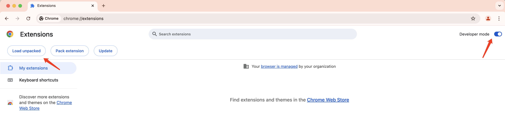
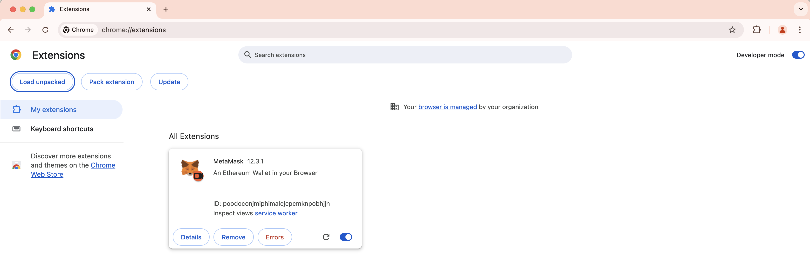
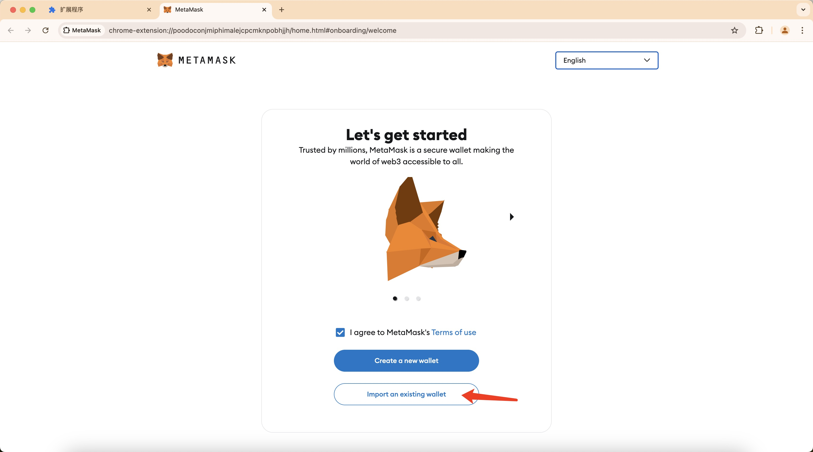
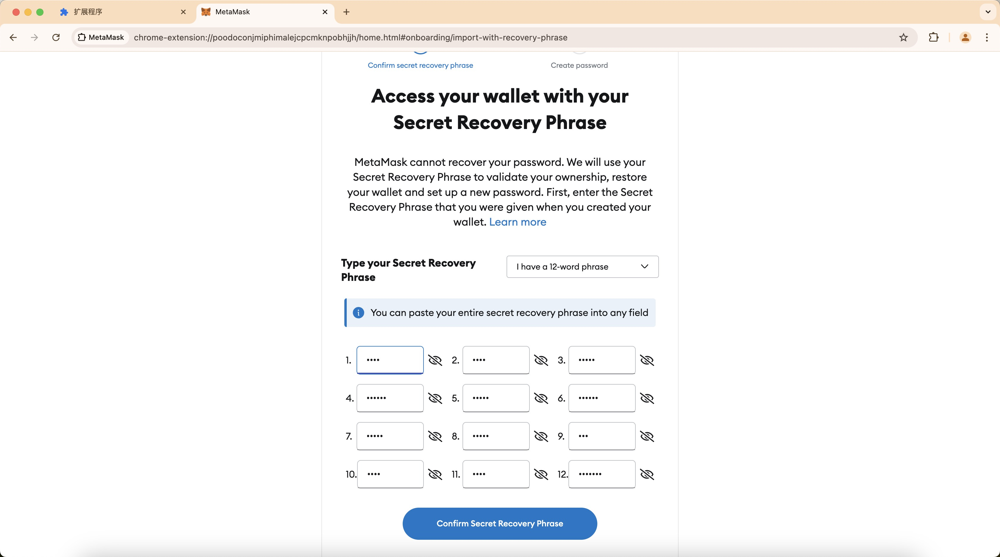

# Rollback to Old Version of MetaMask

Since metamask recent versions made an incompatible change to its algorithm in `personal_sign`, its latest version cannot derive the same BCH address in pay4best as before.

We suggest to switch to metamask snaps wallets such as bchwallet.cash.

If you have some funds stuck in pay4best because of metamask's incompatible change, please follow these steps to recover them by rolling back to an old version of metamask.

## Step1: Download Old Version MetaMask

Goto MetaMask releases page and download the old version zip file for Chrome (in our case, v12.3.1):

https://github.com/MetaMask/metamask-extension/releases

https://github.com/MetaMask/metamask-extension/releases/tag/v12.3.1

https://github.com/MetaMask/metamask-extension/releases/download/v12.3.1/metamask-chrome-12.3.1.zip

After you downloaded it to your disk, unzip it to a folder:

## Step2: Add MetaMask in New Chrome Profile

Open chrome, create a new profile for testing the old version of MetaMask:

https://support.google.com/chrome/answer/2364824?hl=en&co=GENIE.Platform%3DDesktop

Then, in the new profile, goto `chrome://extensions/` page:

And then, toggle on "Developer mode", then you will see "Load unpacked" button, click it add select your unziped Metamask fold to install it:

## Step3: Import Your Mnemonic Code

In MetaMask welcome page, click "Import an Existing Wallet" button:

Agree the items and enter your mnemonic code:

And then continue to finish the MetaMask setup process.

