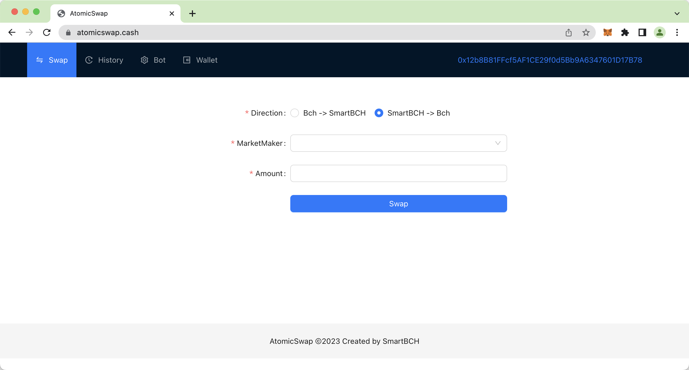
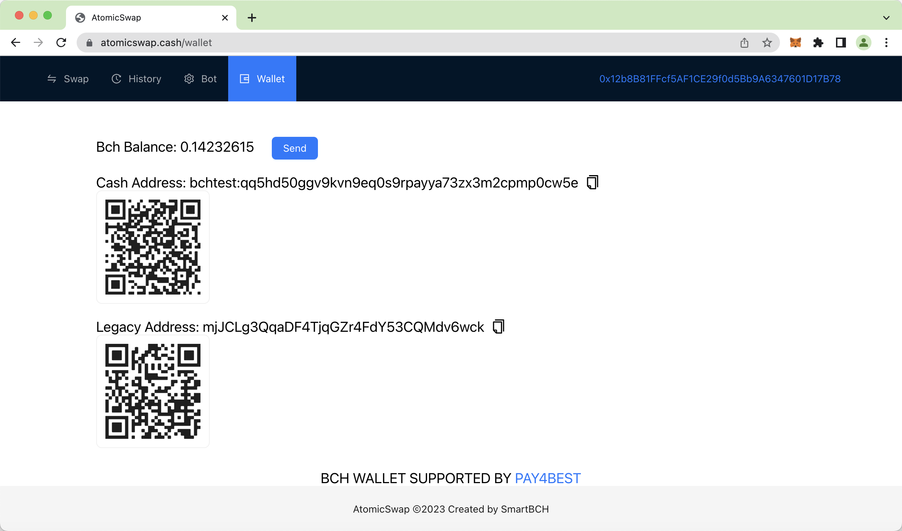
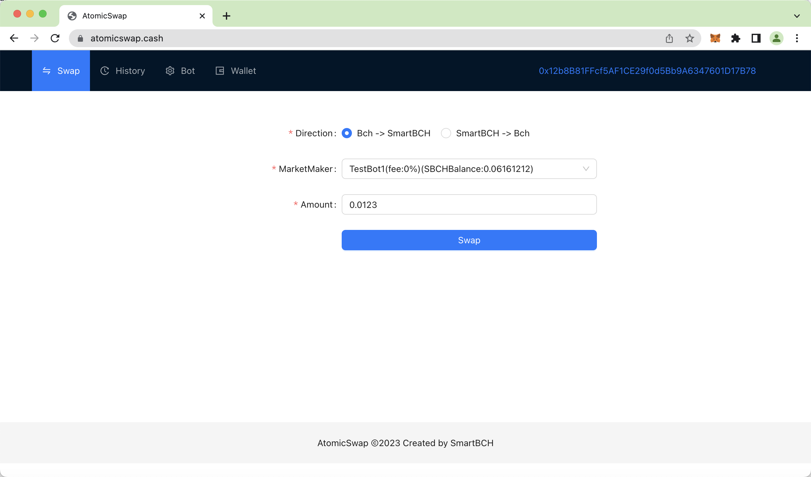
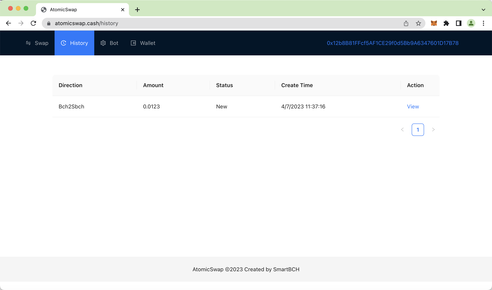
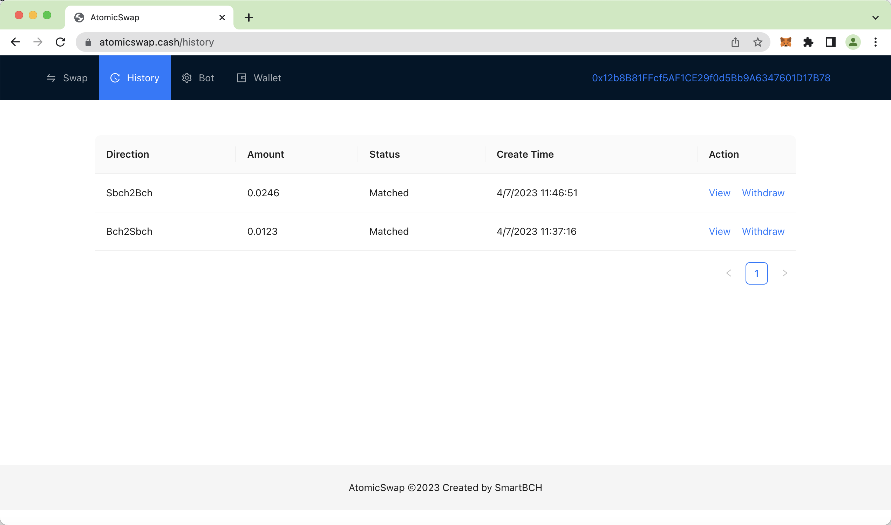
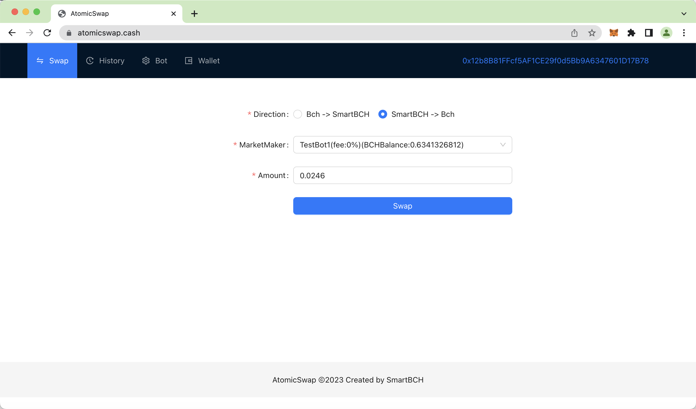
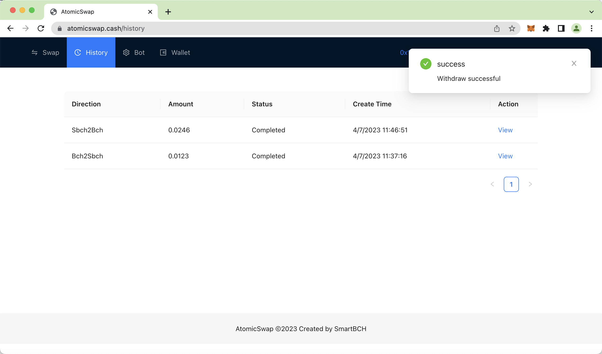

# SmartBCH AtomicSwap User Guide

This document shows how to swap BCH from/to sBCH using [AtomicSwap Web App](https://atomicswap.cash/) on [SmartBCH](https://smartbch.org/) mainnet.

## Main UI

Currently, AtomicSwap UI has four tabs: "Swap", "History", "Bot" and "Wallet". We can do the swap in the "Swap" tab and see our swap histories in the "History" tab. You can ignore the "Bot" tab unless you want to become a Market Marker.

## Wallets

AtomicSwap Web App does not hold any assets, it will connect to MetaMask for SmartBCH and [Pay4Best](https://pay4.best/) for BCH. When you open the page you will be asked to connect to these two wallets. After connected, you can see your SmartBCH address on the right side of the top bar. In the "Wallet" tab, you can see your BCH addresses (in both newly Cash address format and Legacy address format ) and balance. To swap BCH to SBCH, you need to deposit some BCH into one of these two addresses first. To withdraw your BCH, just click the "Send" button.

## Swap BCH to SBCH

To swap BCH from mainchain to the SmartBCH sidechain:

1. Goto the "Swap" tab
2. Select the direction (check the "BCH -\> SmartBCH" radio button)
3. Select a MarketMaker
4. Input the BCH amount to swap
5. Click the "Swap" button(and then the "Confirm" button in a popup dialog)
6. Approve the pay4best wallet to sign the BCH tx and wait a few seconds

Go to the "History" tab to see your in-progress swap.

After your BCH tx was mined into the BCH block and confirmed by the market maker, the market maker will send you SBCH on the SmartBCH sidechain, and the status of the swap will become "Matched". You can then click the "Withdraw" button to withdraw SBCH on the SmartBCH sidechain.

After successful withdrawal, the status of the swap will be changed to "Completed".

## Swap BCH from SBCH

To swap BCH from the SmartBCH sidechain to the mainchain:

1. Goto the "Swap" tab
2. Select the direction (check the "SmartBCH -\> BCH" radio button)
3. Select a MarketMaker
4. Input the BCH amount to swap
5. Click the "Swap" button(and then the "Confirm" button in a popup dialog)
6. Approve the MetaMask wallet to sign the SmartBCH tx and wait a few seconds

Go to the "History" tab to see you in-progress swap. 

Because the SmartBCH sidechain produces blocks in seconds, your swap will be "Matched" (handled by the market maker) quickly. You can then click the "Withdraw" button to withdraw BCH on the mainchain. After successful withdrawal, the status of the swap will be changed to "Completed".

